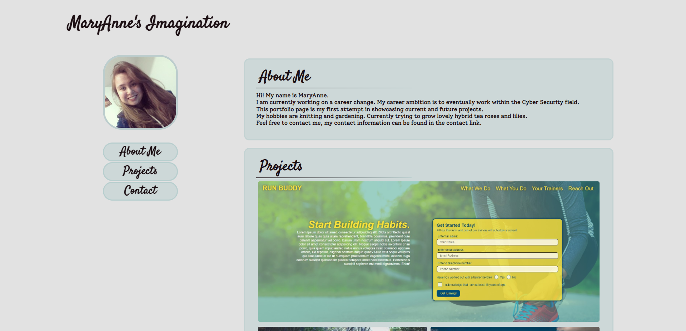
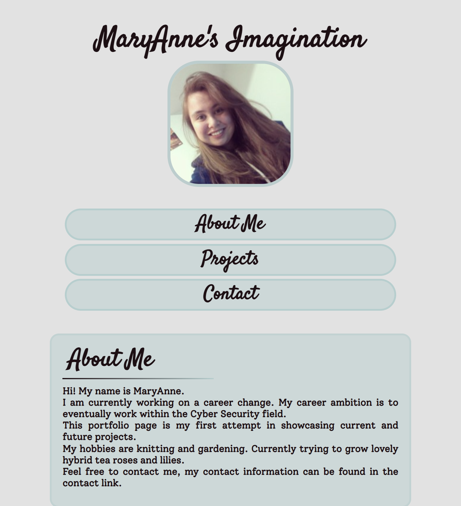
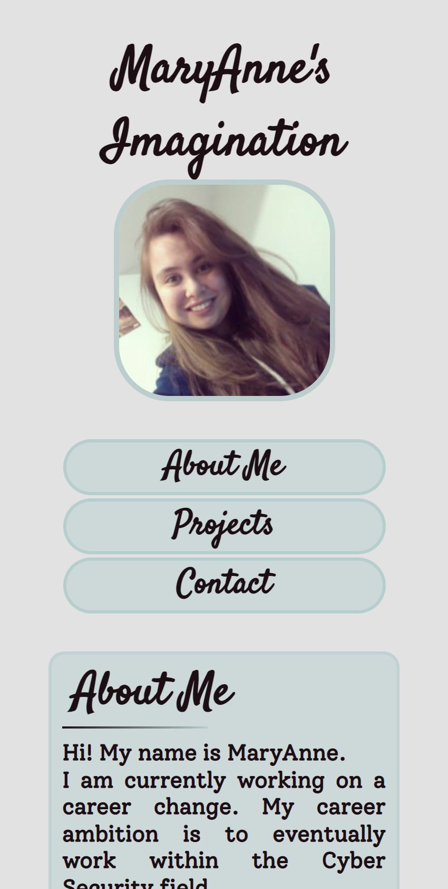

# MaryAnne's Professional Portfolio

## [Display Website](https://purrzim.github.io/MaryAnne-Professional-Portfolio/)

## About this Project

This projects if my first professional portfolio. It is made using HTML and CSS exclusively. The purpose of this project is:
 - To create a professional portfolio that displayed current and furture works
 - Have working links
 - Nav that scrolls to sections on the page
 - Viewable in different media displays

## Screenshots

Website screenshots at different screen sizes.

